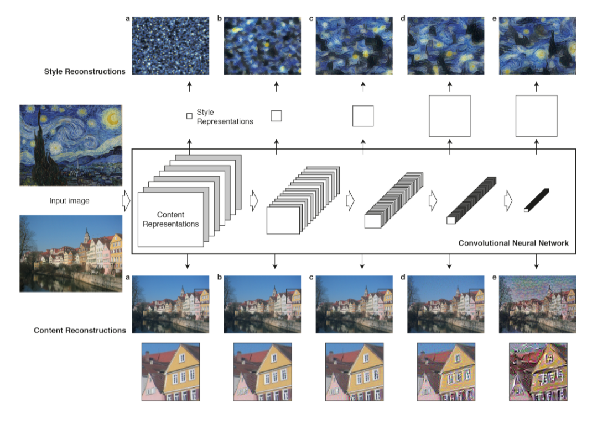

# Neural Artistic Style Implementation in TensorFlow

By Yulun Tian [http://yuluntian.wixsite.com/yuluntian]

(Illustration from "*A Neural Algorithm of Artistic Style*", Gatys et al. 2015)

Video demonstration [https://youtu.be/KvL2OuCClUY]

## Introduction
This project replicates the results in "*A Neural Algorithm of Artistic Style*", Gatys et al. 2015. A neural network is trained to create new artistic images by recombining styles and contents from different inputs. Total variation denoising is also integrated to ensure the output image is visually coherent.

The original paper can be accessed here: [https://arxiv.org/abs/1508.06576]

The neural network used in this project is based on a VGG16 model pre-trained on ImageNet. The model is kindly provided by Davi Frossard: [https://www.cs.toronto.edu/~frossard/post/vgg16/]

## Run this project
To run this project, make sure you have [TensorFlow](https://www.tensorflow.org/install/) installed. This project is currently compatible with TensorFlow 1.0.

Also, download the pre-trained VGG 16 model using this [link](https://www.cs.toronto.edu/~frossard/vgg16/vgg16_weights.npz), and place the downloaded *vgg16_weights.npz* file under *vgg16/models/*.

To run a demo, run the following in your terminal:

`python neural_artist.py`

To see the full options, run:

`python neural_artist.py --help`
